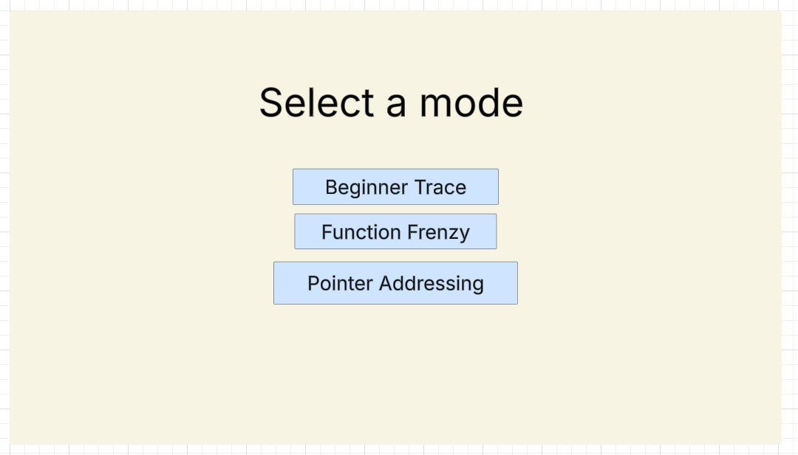
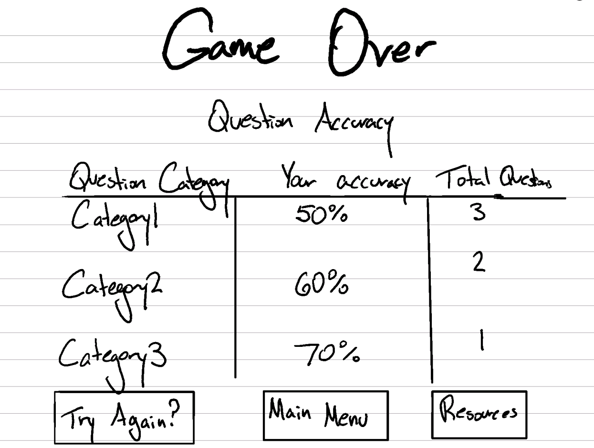
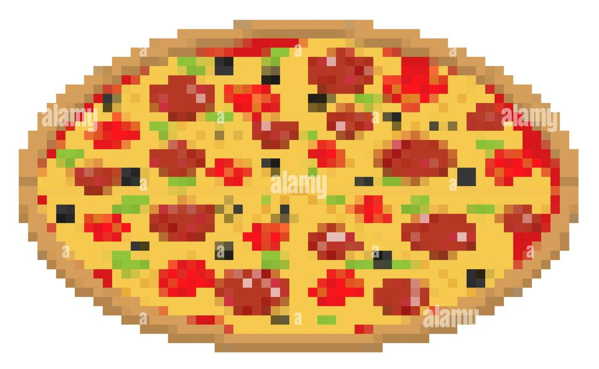
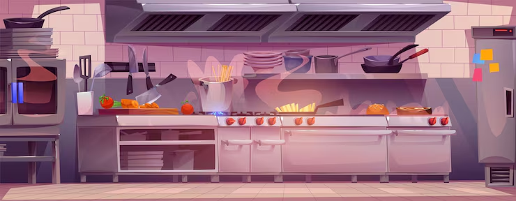
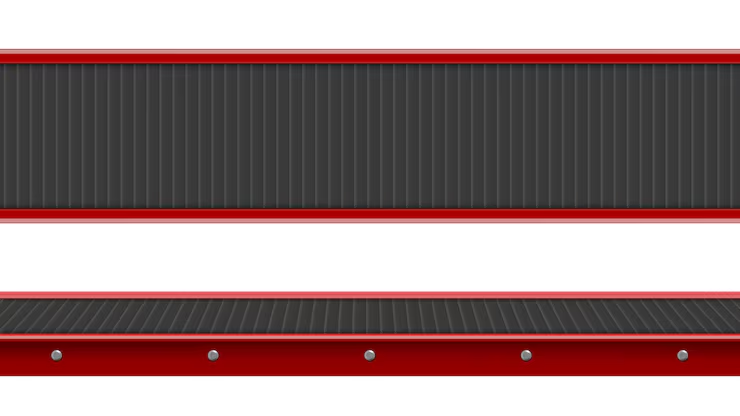

# That's Not My Programmer

## Elevator Pitch

It is the lunch rush and you need to hurry! You are the cook, and you make all of the orders fast; however, the ticket machine malfunctioned and is now only code snippets! You have to be quick and decipher the structs and main code to make the correct order; if not, you will have a couple of angry cutomers, and maybe an angry manager on top of that.

## Influences (Brief)

- Overcooked:
    - Medium: Games
    - Explanation: Rhythm Heaven; very hectic and fast, has you think on your feet.
- Pizzatron 3000 Minigame - Club Penguin:
    - Medium: Games
    - Explanation: Pizzatron 3000 minigame from Club Penguin, fast paced pizza maker game where you must correct decisions as the pizzas appear in front of you on a conveyor belt.
- Papa's Pizzeria:
    - Medium: Games
    - Explanation: Fast paced pizza maker game where you must make the correct orders for the customers. The game gets progressively more stressful as you have more orders to manage and remember.

## Core Gameplay Mechanics (Brief)

- Order tickets come in containing a code snippet.
- The code snippet contains a struct that makes up the orders, with fields containing variables.
- You drag and drop the ingredients based on the struct to make the correct order.
- The more you get correct, the more orders that come in, giving the player less time to answer, but they are compensated with more points.
- When the player gets a question wrong, the amount of orders slow down.
- A Combo meter is filled for a correct answer streak, which gives the user more points.

# Learning Aspects

## Learning Domains

Semi-Introductory programming, code tracing, and function scope.

## Target Audiences

Introductory C students, slightly familiar with coding, but lacking fundamentals. Appropriate for any age. Best suited as a prerequisite for CISC210.

## Target Contexts

(K-12) computer lab style game, fun practice activity given at the start the semester.

## Learning Objectives

- Identifying Variable Values: By the end of the lesson, players will be able to identify if the value in a snippet of code has changed after a variety of function calls.
- Recognizing Pointer Updates: By the end of the lesson, players will be able to identify if a pointer has updated a specific variable’s value.
- Monitoring Global Variables: By the end of the lesson, players will be able to correctly identify the value of a global variable after a function call.
- Trace Sequential State: By the end of the lesson, players will be able to accurately log how a variable’s value changes over multiple assignment operations.
- Identifying Struct and Field values: By the end of the lesson, players will be able to identify the initialization of the fields in the structs.

## Prerequisite Knowledge

- Prior to the game, players need to be able to interpret basic C code (=, if, function).
- Prior to the game, players need to be able to explain the difference between a local and global variable.
- Prior to the game, players must identify when a pointer changes the value of a variable indirectly.
- Prior to the game, players must explain what a pointer is.
- Prior to the game, players must explain what a memory address is.
- Prior to the game, players must identify the “address of” operator.
- Prior to the game, players must identify the dereference operator.

## Assessment Measures

Question 1: Basic trace
<br>
Identify the value of "cheese" for the struct "cheeseBurger":

```C
struct Burger {
  boolean cheese;
  char condiments[2][10]
}

void main(){
  Burger cheeseBurger;
  cheeseBurger.cheese = false;
  cheeseBurger.condiments = {"ketchup","mayo"};
  cheeseBurger.cheese = true;
}
```

Grading Logic: The correct answer is true. Any other answer is incorrect.

<br><br>

Question 2: Global vs Local trace
<br>
Identify the value of the variable “sauce_bottles” after the following lines of code are executed:

```C
int sauce_bottles = 10;

void make_spicy_tuna() {
    int sauce_bottles = 2;
    sauce_bottles = 5;
}

sauce_bottles = sauce_bottles - 1;
make_spicy_tuna();
sauce_bottles = sauce_bottles + 3;
```

Grading Logic: The correct answer is 12. Any other answer is incorrect.

<br><br>

Question 3: Pointer Update
<br>
Identify the value of the variable “salmon_order” after the following lines of code are executed:

```C
int salmon_order = 2;
int *ticket = &salmon_order;

*ticket = 5;
int extra = 3;
*ticket = *ticket + extra;
```

Grading Logic: The correct answer is 8, any other answer is incorrect.

# What sets this project apart?

- This game builds muscle memory for programming and quick debugging foundations, while abstracting away the code to make students stress less.
- This game allows you to recognize when a value changes quickly due to the incentive of time.
- It puts the idea of coding in a unique environment, making the gameplay loop much more enjoyable since it reminds you of other time crunch games.
- The game offers a unique risk reward mechanic with the lunch rush boost, which allows for players to gain much more points at the cost of less time to answer the questions.
- This game gives players a break from an IDE/coding environment, replacing errors and incorrect answers with lost points, helping to change the environment and replace a frustrated mindset.

# Player Interaction Patterns and Modes

## Player Interaction Pattern

This is meant to be a single player game, but with an arcade-style leaderboard to incentivize players to get the highscore, either for their personal best, or between friends and classmates.

## Player Modes

- Main Menu: The main screen the game boots to, allows you to select one of the 3 different modes of the game you want to play from their associated buttons.
- Basic Trace: A basic version of the game where you trace through a statement of code with no function calls or pointer references. You must determine what the values of the fields are to make the order.
- Function Trace: An intermediate version of the game where you trace through a code snippet with a function call, global, and local variables. You must determine what the values of the fields are to make the order.
- Pointer Trace: The most difficult version of the game where you trace through a code snippet involving variables and pointers holding the addresses of the variables which may update those other variables. You must determine what the values of the fields are to make the order.
- Game Over: A game over screen played after you have advanced through many questions and have not reached the correct amount of points. Allows you to go back to the home screen.

# Gameplay Objectives

**Make the Order**:

- Description: The order ticket is added to your list, you have to check the code, and determine what the ingredients are based off of the fields.
- Alignment: This aligns with the “identifying struct and field values” learning objective, as players must correctly identify the value of a variable.

**Rack Up Points**:

- Description: Your main goal is to rack up as many points over a certain time period. This will allow you to get a high score.
- Alignment: You are able to get points by getting orders right, and you can get more points by getting many orders right in a row to speed up the orders, which by getting a question correct you prove understanding of the 3 learning objectives.

**Combo Counter**:

- Description: When you get a certain amount of orders right in a row, you activate Lunch Rush, where the amount of orders speed up and you can collect a large amount of points, this gives skilled players a decent challenge.
- Alignment: You are able to activate lunch rush by getting the correct orders, and allows you to rack up points for a high score, showing that you are getting faster at tracing code, thus satisfying the learning objectives laid out earlier.

# Procedures/Actions

- Click mode select to play the selected mode.
- Drag and drop the food items to create the order.

# Rules

The player has points they can use to buy powerups to slow the progression of the questions (slow down the speed of the belt). These points are accumulated by answering questions and serves as a way to save up and reward the player by giving them a slight mental break.

# Objects/Entities

- A stove entity
- A kitchen table top entity
- Plates to represent orders
- A ticket to represent the current code snippet
- Various ingredients
- Background screen
- Main game screen
- Pause menus
- Clock timer

## Core Gameplay Mechanics (Detailed)

**The "Code Tickets"**:
<br>
This is the code snippet on the tickets that the player has to currently trace through. It displays the snippet the player must parse. As the level progresses, the code may change to reflect a different question, but the style is the same for each question of the same “mode”. After figuring out the different field variables, the player must drag and drop the correct ingredients. Early levels will show less lines of code; later levels will show more lines of code including more complex control structures such as loops, if statements, and function calls.

**The "Shift Timer"**:
<br>
This timer adds an element of pressure and rush to the game, as the game is trying to teach students to correctly identify field variable values and decrease the time it takes to do so. When the player gets a question right, more orders come in. If the player gets the order wrong, they gain no points and their streak is reset. At higher difficulties, orders come in more frequently, forcing faster reactions to correctly answer the question.

**Sending Out Orders**:
<br>
This is the player’s primary way of interacting with the variables. Players drag and drop the ingredients to make the correct order.
If the player makes the correct order, the score increases, a correct sound plays, and the combo meter is incremented. If the incorrect order is made, the score does not change, but the combo meter is reset, and an incorrect sound plays.

## Feedback

The player will accumulate points towards their total score after answering questions correctly. When a question is answered correctly there will be a green flash of light at the end of the screen as the order leaves. If the question is answered incorrectly there will be a red flash of light when the order leaves the screen, and they will gain no points. Additionally there will be separate audio tracks for when the player answers the question correctly vs. incorrectly. The more questions the player gets correct, the closer they are to achieving the learning objective for that level of questions.

# Longer Term Feedback

We collect the player’s score, as well as the total number of questions answered correctly, and the total number of questions the player has attempted. The player will not have as many points if they have been consistently incorrect. When the player has been answering many questions correctly, the pace of the problems will speed up, and the code snippets will get longer, but they will also get more points during these “phases”. At a certain point if the player has not answered enough questions correctly, the game will end and recommend that they try again, and may provide links to relevant materials. At the end of a level, the player will be provided with analytics about the questions and topics they have answered incorrectly. When the player is able to progressively get to the end of a level and the speed has been increasing, then they know they have progressed and have mastered the learning objective.

# Story and Gameplay

## Presentation of Rules

There will be a short instruction blurb when loading the game mode, telling the player to assess the correct ingredients looking at the code ticket. Drag and drop the associated ingredients for your answer. The ingredients will also have a glowing animation around them at first to guide the player’s eyes to them.

## Presentation of Content

The game will start slowly with a few lines of code, and the player will not be able to progress to different questions until they have answered a certain amount of questions correctly for that category. After they have answered those questions correctly it is assumed that they have the necessary knowledge to progress to a more difficult topic/level, as well as an increased pace in answering questions.

## Story (Brief)

This game will have you be a server in a kitchen and you must construct the correct dishes by correctly assessing the content of the variables that make up the order.

## Storyboarding

**Mode Selector Screen**:
<br>


**Gameplay Storyboard**:
<br>


**Game Over Screen**:
<br>


# Assets Needed

## Aethestics

That's Not My Programmer blends the gameplay of Papers, Please with the rhythm of classic 80s arcade games such as Galaga.
An industrial metal belt carries white plates to construct the order and the ticket corresponding to the order is shown on the screen.
Rhythmic music keeps pace with the speed of the level, and satisfying sounds play when the correct decision is made and a frustrating sound is played for incorrect answers.
When you answer a question at the last second, the game rewards you with a sense of relief. You leave each level feeling more confident in your programming abilities as you have just practiced your craft.

## Graphical

- Characters List
    - Cook: This is the main character, they are the character you control and is the one that makes the orders. They make sure they are the star employee at the workplace, making sure the food goes out on time.
    - Manager: This is the character that you meet at the end of the game, especially if you do a bad job. They serve as a game over screen.

**Textures**:

- Pizza Sprite:

<br>



- Burger Sprite:

<br>


- Plate Texture:

<br>


**Environment Art/Textures**:

- Kitchen Background:

<br>



- Conveyor Belt:

<br>



## Audio

- Music List (Ambient sound)
    - Title theme: Lobby Music - Papa’s Freezeria
    - Normal mode: First Track - Night of the Consumers
    - Fever mode: Physical Challenge - Deltarune

- Sound List (SFX)
    - Correct guess: Tada sound - Windows 3.1
    - Wrong Guess: Incorrect buzzer sound effect
    - Throwing Away Food: Squash Sound - Deltarune

# Metadata

- Initial version of That's Not My Programmer Educational Game Design Document
- Template created by Austin Cory Bart <acbart@udel.edu>, Mark Sheriff, Alec Markarian, and Benjamin Stanley.
- Version 0.0.4
